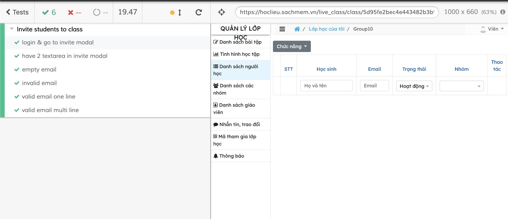

# Chạy Cypress Command Line

* Install Cypress: npm install cypress --save-dev
* Copy tập tin 'invite_student.spec.js' vào thư mục 'cypress/integration/'
* Thêm option "chromeWebSecuriry": false vào file cypress.json 
* Chạy lệnh sau trên cửa sổ cmd: cypress run  cypress/integration/invite_student.spec.js
* Xem kết quả hiển thị trên cửa sổ cmd

# Kết quả chạy test

