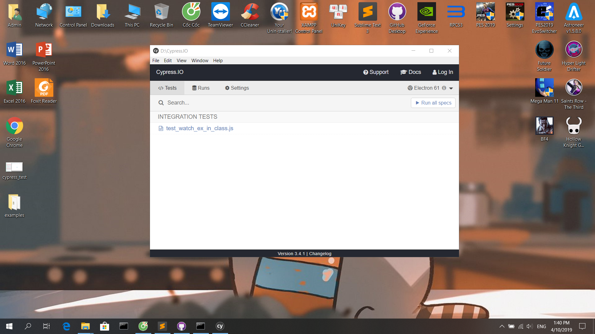
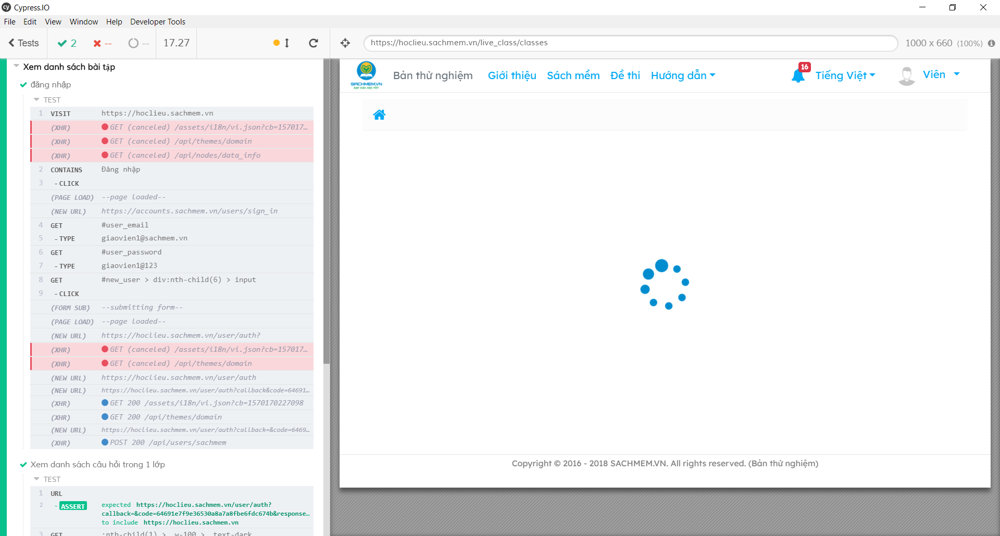

# Nhóm 17
>Thành viên:
* Đinh Việt Cường
* Vũ Đức Dũng
* Bùi Văn Bảo

# Chạy ca kiểm thử trên Cypress

>Hướng dẫn thực hiện:	
* Tạo thư mục mới (ví dụ: project_test)
* Cài đặt Cypress vào thư mục trên thông qua cmd: 
	- npm init
	- npm install cypress --save-dev
* Tại thư mục vừa tạo: 
	- Copy tập tin 'test_watch_ex_in_class.js' vào thư mục 'cypress/integration/'
	- Thêm dòng sau vào file cypress.json
		{ "chromeWebSecurity": false }
* Thêm dòng sau vào file 'index.js' tại thư mục 'cypress/support/'
	- Cypress.on('uncaught:exception', (err, runnable) => { return false })
* Chạy lệnh sau trên cửa sổ cmd: 
	- npx cypress open
* Màn hình tượng trưng sau khi chạy:
	
* Ấn vào file test_watch_ex_in_class.js
* Kết quả sau khi chạy
	
