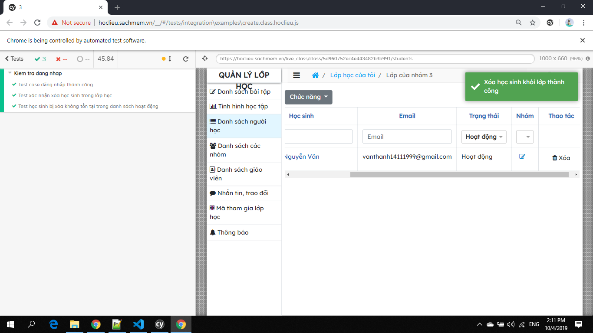

# Cài đặt và sử dụng Cypress
* Install Cypress: npm install cypress --save-dev
* Copy tập tin 'ft.delete_student.js' vào thư mục 'cypress/integration/'
* Thêm option "chromeWebSecuriry": false vào file cypress.json 
* Chạy lệnh sau trên cửa sổ cmd: ./node_modules/.bin/cypress open
* click option ft.delete_student.js và chạy bằng chrome

# Kết quả nhận được
