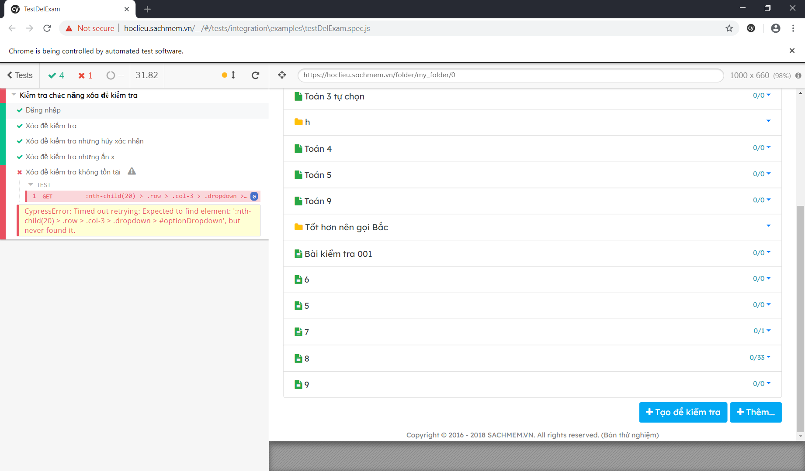

<h1>Nhóm 33</h1>

<h2>Thành Viên</h2>
1. Trịnh Hữu Thắng  
2. Trần Xuân Tiến 
3. Phạm Thị Thu Sương 
4. Phạm Hồng Quang 

<h3>Để chạy test</h3>
B1. Tạo 1 thư mục mới: ví dụ Test 
B2. Mở cmd tại thư mục Test, gõ lệnh npm init và npm install cypress 
B3. Mở cypress và tạo thư mục cypress để chạy test gõ lệnh npx cypress open 
B4. Đặt file testDelExam.spec.js vào thư mục cypress/integration/examples trong thư mục Test 
B5. Mở cypress, tìm file testDelExam.spec.js rồi click vào 

<h3>Kết quả</h3>

